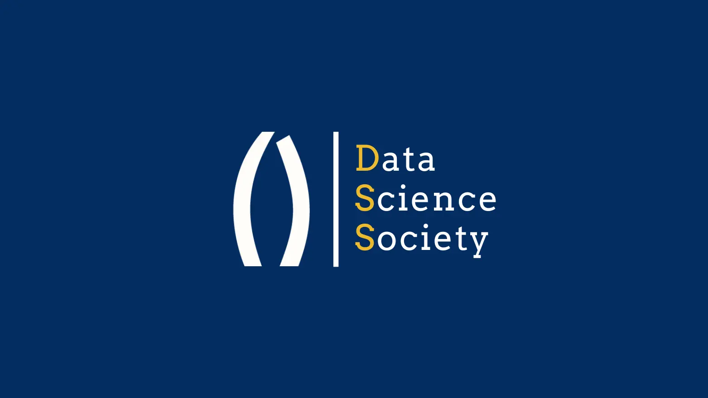

We are a brand-new student-led organization established this year! Our organization is committed to building a collaborative community for all UC Merced community members interested in data science, machine learning, and analytics. Whether you are simply interested in data science or want to explore the field more deeply, we are sure to have something for everyone! 

We host workshops, guest talks, and project-based learning opportunities to help our members develop practical skills, explore real-world applications, and connect with peers and industry professionals. Whether you're a beginner or an experienced engineer, we strive to make data science accessible, engaging, and impactful for all!

Diversity & Inclusion Statement
======
DSS is deeply committed to fostering an inclusive, respectful, and welcoming environment where every student, regardless of background, identity, or level of experience, feels valued and empowered to contribute. 

We recognize that diversity in thought, culture, race, ethnicity, gender identity, sexual orientation, socioeconomic status, ability, and life experience enriches our community and strengthens our collective ability to innovate and solve complex problems. 

We actively work to remove barriers to participation by creating accessible learning opportunities, encouraging open dialogue, and promoting equity in leadership and decision-making within the organization.

We design our events, workshops, and projects to support all, from beginners to advanced members, ensuring that everyone has the resources and mentorship needed to grow and thrive.

By embracing diverse perspectives and fostering a culture of empathy, collaboration, and mutual respect, we aim to prepare our members to become not only skilled data scientists but also ethical and socially conscious leaders who can make a positive impact in their communities and beyond.
